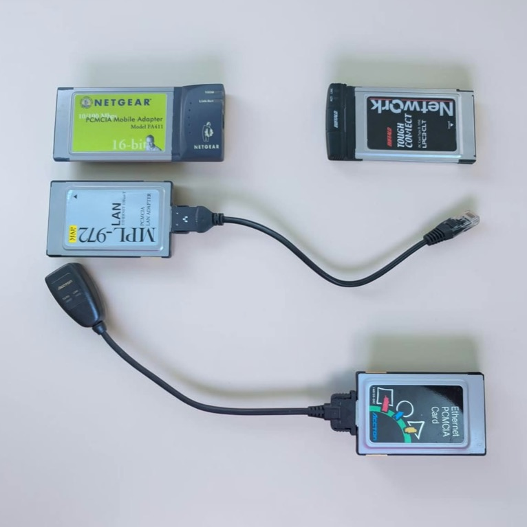
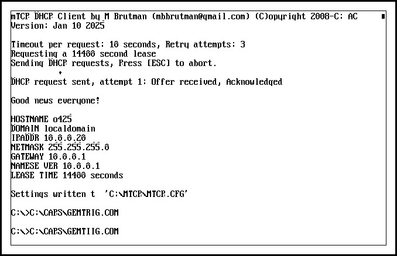
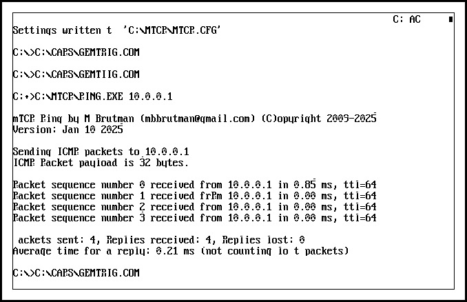
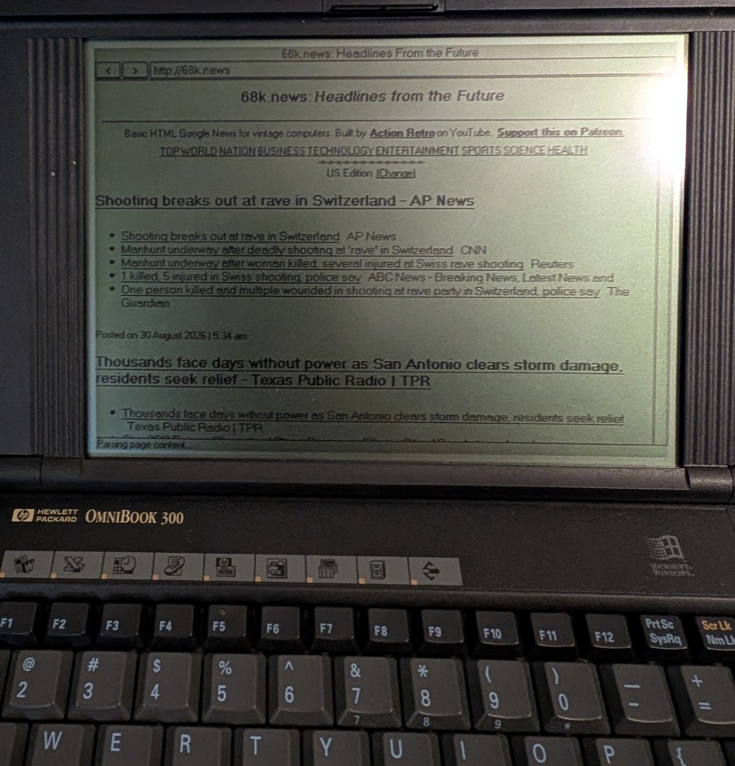
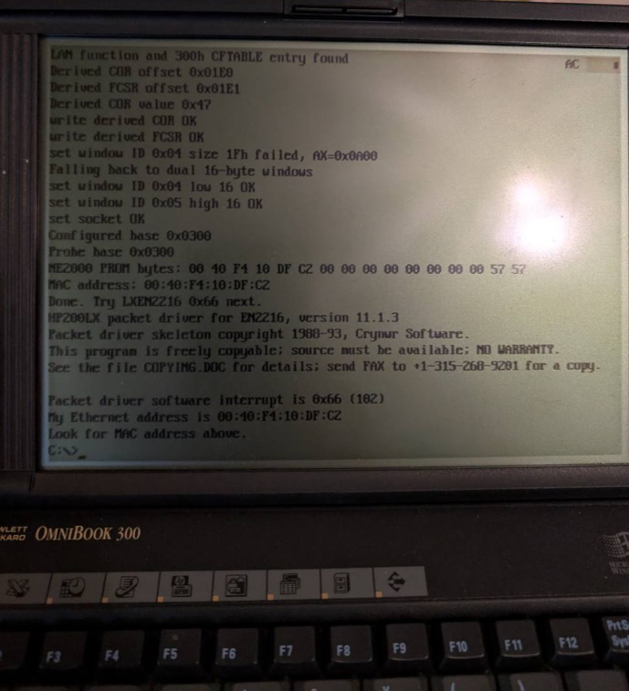

# OmniBook 300 PCMCIA Network Stack

PCMCIA NE2000-family Ethernet enablement for the HP OmniBook 300.

This project provides an OmniBook 300-specific card enabler and DOS helper
files that make several 16-bit PCMCIA NE2000-compatible Ethernet cards visible
at I/O base `300h`, then hand off to Rod Whitby's `LXEN2216.COM` packet driver.
Once the packet driver is loaded, normal DOS TCP/IP software such as Michael
Brutman's mTCP and MicroWeb can use the network.



## Status

Release 1.0 is the first known working public package.

Confirmed on an HP OmniBook 300 with these cards:

| Card | Result |
| --- | --- |
| Netgear FA411 10/100 PCMCIA Mobile Adapter | DHCP, ping, MicroWeb working |
| Buffalo Tough Connect LPC3-CLT | MAC detection and packet-driver load confirmed |
| MAP Japan MPL-972/Tamarack | MAC detection and packet-driver load confirmed |
| Accton EN2216-1 | MAC detection and packet-driver load confirmed |

The OmniBook 300 also continued to recognize a PCMCIA storage card in the other
slot while the network stack was loaded.

## What This Does

`O300NIC.COM` is a non-resident card enabler. It:

- reads the inserted card's CIS through the OmniBook 300 card BIOS interface
- checks for a LAN function and a `300h` CFTABLE I/O entry
- derives the card's COR/FCSR offsets and COR value from CIS data
- writes the card configuration registers
- maps the OmniBook 300's PCMCIA I/O windows as two adjacent 16-byte windows
- configures the socket IRQ, defaulting to IRQ 5
- probes the NE2000 PROM and prints the MAC address

It does not stay resident. After enablement, `LXEN2216.COM` provides the packet
driver interface on software interrupt `0x66`.

## What This Does Not Include

This repository does not include MS-DOS, Windows, mTCP, MicroWeb, or the
third-party `LXEN2216.COM` packet driver.

Useful upstream links:

- Rod Whitby's LXETH package containing `LXEN2216.COM` and `TERMIN.COM`:
  <https://sourceforge.net/projects/rwhitby/files/HP200LX%20Ethernet%20Drivers/1.0/lxeth10b.zip/download>
- Michael Brutman's mTCP:
  <https://www.brutman.com/mTCP/mTCP.html>
- mTCP January 10, 2025 ZIP:
  <https://www.brutman.com/mTCP/download/mTCP_2025-01-10.zip>
- MicroWeb:
  <https://github.com/jhhoward/MicroWeb>
- MicroWeb v2.1 release:
  <https://github.com/jhhoward/MicroWeb/releases/tag/v2.1>

## Quick Install

The release ZIP contains an `O300NET` directory. Copy it to the root of the
OmniBook 300 C: drive:

```dos
XCOPY O300NET C:\O300NET /S
```

Install the LXETH packet driver files separately:

```text
C:\LXNET\LXEN2216.COM
C:\LXNET\TERMIN.COM
```

Optional mTCP and MicroWeb layout used during testing:

```text
C:\MTCP\DHCP.EXE
C:\MTCP\PING.EXE
C:\MTCP\MTCP.CFG
C:\MWEB\MICROWEB.EXE
C:\MWEB\*.DAT
```

Add these paths to `AUTOEXEC.BAT` if desired:

```dos
PATH C:\O300NET;C:\LXNET;C:\MTCP;C:\MWEB;%PATH%
SET MTCPCFG=C:\MTCP\MTCP.CFG
```

## Test Sequence

Insert one of the supported PCMCIA Ethernet cards, then run:

```dos
C:
CD \O300NET
NICUP
```

The enabler should print a real MAC address, then `LXEN2216.COM` should print
the same MAC address and install on packet interrupt `0x66`.

Then test mTCP:

```dos
TCPUP
C:\MTCP\PING.EXE 10.0.0.1
WEB http://68k.news
```

Use your own gateway address if DHCP reports something other than `10.0.0.1`.

Unload the packet driver with:

```dos
NICDN
```

## Proof Of Life

DHCP lease through mTCP:



Ping through mTCP:



MicroWeb browsing `68k.news`:



O300NIC identifying a tested card and handing off to the packet driver:



## Build

Install NASM, then run:

```sh
./build.sh
```

The build emits `.COM` files into `bin/`.

## Notes

If you are booting an OmniBook 300 C: drive from a PCMCIA/CF storage card, the
machine still needs the OmniBook 300 System/Application ROM card in the D slot
to initiate C-drive booting. That ROM card requirement is separate from this
network enabler.

This is early retrocomputing software. Keep a backup of bootable cards before
testing.
