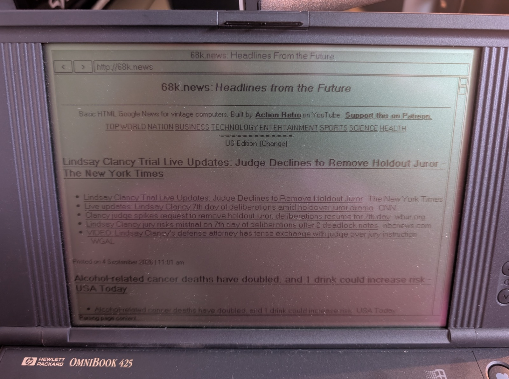

# OmniBook 425 Notes

These notes summarize the OmniBook 425 experiments from September 2026.

## Current Result

The Netgear FA411 is the only card currently proven working on the OmniBook
425. It was brought up with the OmniBook 300 baseline enabler and the generic
Crynwr NE2000 packet driver:

```dos
C:
CD \O300NET
O300NIC.COM 5
C:\O300NET\CRYNWR\NE2000.COM 0x66 5 0x300
SET MTCPCFG=C:\MTCP\MTCP.CFG
C:\MTCP\DHCP.EXE
C:\MTCP\PING.EXE gateway-address
```

The shared wrapper form for new Crynwr testing is:

```dos
C:
CD \O300NET
NE2KUP
TCPUP
```

After DHCP succeeded, MicroWeb loaded `http://68k.news/` with:

```dos
MICROWEB.EXE -video=h http://68k.news/
```



The same FA411 approach also worked with a PCMCIA storage card present in the
other OmniBook 425 slot.

Observed FA411 proof:

```text
O300NIC.COM 5
  COR offset 01E0h
  FCSR offset 01E1h
  COR value 47h
  NE2000 hardware reset OK
  MAC <card-mac>

NE2000.COM 0x66 5 0x300
  Packet driver loaded at software interrupt 66h

DHCP
  IPADDR <dhcp-address>
  GATEWAY <gateway-address>

PING <gateway-address>
  4 replies received, 0 lost
```

## Important Difference From The OmniBook 300

The OmniBook 300 working path maps socket 1 I/O through Socket Services windows
`04h` and `05h`. On the OmniBook 425, socket 1 was observed using windows `06h`
and `07h`. Rewriting `04h`/`05h` on the 425 can collide with a PCMCIA storage
card and cause DOS errors such as:

```text
General failure writing drive C
```

`O300NIC.COM` v1.3 therefore scans for the socket 1 I/O windows before mapping
the NE2000 register block. This keeps the OmniBook 300 behavior while allowing
the OmniBook 425 FA411 path to use `06h`/`07h` when that is what the card BIOS
has assigned.

## Packet Driver Notes

The OmniBook 300 release path still uses Rod Whitby's `LXEN2216.COM`. On the
OmniBook 425 FA411 tests, `LXEN2216.COM` loaded but DHCP timed out; the generic
Crynwr `NE2000.COM` packet driver completed DHCP and MicroWeb browsing.

## Card Results

| Card | O425 result | Notes |
| --- | --- | --- |
| Netgear FA411 | Working with Crynwr `NE2000.COM` | `O300NIC.COM 5`, IRQ 5, port `300h`, DHCP and ping passed |
| Netgear FA411 | Fails with `LXEN2216.COM` | Driver loads and receives ambient traffic, but DHCP and ARP fail |
| Accton EN2216-1 | Fails | CIS/config/MAC work, but reset does not assert and `NETLOOP` remote DMA always times out |
| Accton EN2216-1 in B slot | Fails | Visible as socket `02`; forced socket-2/window-6-7 enabler still fails remote DMA and DHCP |
| Buffalo LPC3-CLT | Fails | CIS/config/MAC work, but reset does not assert and `NETLOOP` remote DMA always times out |
| MAP Japan MPL-972/Tamarack | Not proven on O425 | Not compatible with the frozen OmniBook 300 baseline, so it is not a current O425 candidate |

## Technical Assessment

The FA411 differs from the Accton and Buffalo cards at the Card Information
Structure configuration level:

| Card family | Config base | COR offset | FCSR offset | COR value | O425 reset result |
| --- | ---: | ---: | ---: | ---: | --- |
| Netgear FA411 | `03C0h` | `01E0h` | `01E1h` | `47h` | `NE2000 hardware reset OK` |
| EN2216-family, Accton/Buffalo | `03F8h` | `01FCh` | `01FDh` | `60h` | reset did not assert |

The O425 can read CIS data, write COR/FCSR, map two 16-byte I/O windows, and
read the MAC from the EN2216-family cards. The failure appears later: the
8390/NE2000 reset and remote-DMA/data-port path do not behave correctly.
`NETLOOP.COM` consistently reports remote DMA timeouts before any packet
driver is loaded, so the Accton and Buffalo failures are below DHCP, ARP, and
IRQ-level packet-driver behavior.

The Accton B-slot test reduces the chance that this is a simple bad physical
slot issue. A read-only socket scanner found FA411 in socket `01` and Accton
in socket `02`; a forced socket-2 enabler mapped windows `06h`/`07h` to socket
2 at `300h`/`310h`, read a valid card MAC address, then reproduced the same
remote-DMA and DHCP failure.
